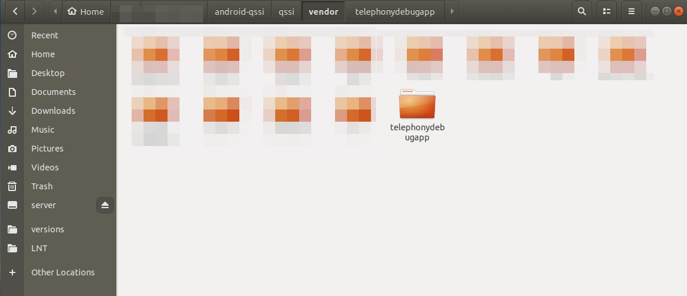

# 目录说明

> Aim to study only, not for commercial!!!

区别于`samples/`下的modules都是可以用AS直接编译的，这个目录下针对的是framework开发使用的app。

当app需要使用 **非public api** 时，可以将`samples-bp_mk/` 下的modules按需要整个拖到类似AOSP下的目录结构里（推荐`/vendor`），然后像编译其他模块一样编译出apk。

```
source build/envsetup.sh
lunch xxx(产品名)
make xxx(.bp里定义的) -j4
```




得到编译好的apk后，由于分区的原因，可能需要先在`sysem_ext/app/`下创建一个文件夹xxx，然后再push。

```
adb push xxx.apk /system_ext/app/xxx/
```
