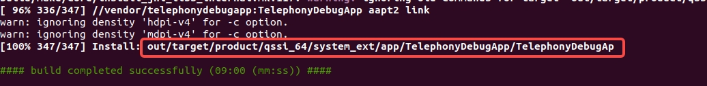
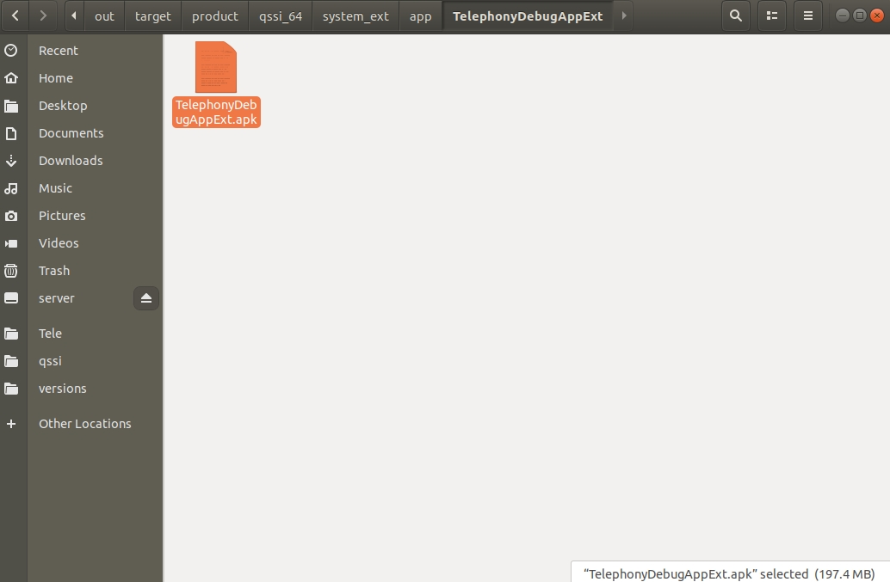

# 目录说明

> Aim to study only, not for commercial!!!

区别于`samples/`下的modules都是可以用AS直接编译的，这个目录下针对的是framework开发使用的app。

当app需要使用 **非public api** 时，可以将`samples-bp_mk/`
下的modules按需要整个拖到类似AOSP下的目录结构里（推荐`/vendor`），然后像编译其他模块一样编译出apk。

```
source build/envsetup.sh
lunch xxx(产品名)
make xxx(.bp里定义的) -j4
```




得到编译好的apk后，由于分区的原因，可能需要先在`sysem_ext/app/`下创建一个文件夹xxx，然后再push。

```
adb shell && cd XXX && mkdir XXX
...
adb push xxx.apk /system_ext/app/xxx/
```

说明：
如上apk的推入位置，要依据bp脚本来。

因为不同的系统源码导致static_libs编译结果不一致，所以新建一个`_fat`的源码包。这个包里的开发**尽量使用已知的实现
**。
> bp文件里引入的库，即使在代码里没有使用，也会增加apk的大小。

fat表示引入的库**并不是**
来自fwk提供，而是来自其他（如由android_library）编译出来，有依赖的依赖，也都会集成到自身的apk里，编译产物会很大。如下是两种的比较：




另外，这种方式使用代码有风险，毕竟你引用的是别的app的类，只要别的app一变化自身就需要更改，或者平台不同也有编译不过的风险。如：

